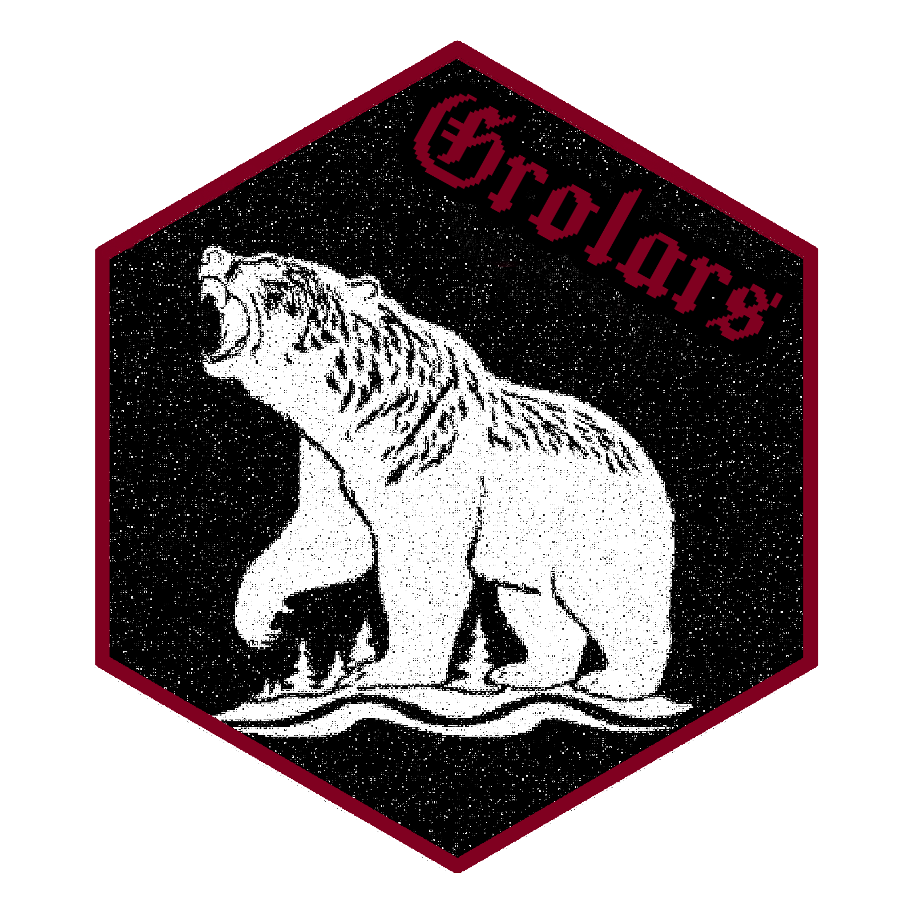

# grolars 


*El grolar es un híbrido natural entre el oso grizzly y el oso polar. Hace un siglo era un milagro, pero con la velocidad que está cambiando el mundo moderno, se hacen cada vez más comunes.*

## Overview

`polars` es un gran gestor de dataframes, se recomienda usar para archivos sobre 100 mb, que representen un problema en memoria ram o sean demasiado para la maquina de trabajo. El problema aca es que la API del paquete `r-polars` está diseñada desde una perspectiva pythonista. Este branch del paquete original busca reimplementar la API usando los mismos binders de base, pero **tidy-first**: usando las convenciones estándar de R y no ser una mera copia de Python en R.

La idea es hacer un híbrido — la velocidad de rust-polars con el ecosistema maduro, data-driven y ya conocido del tidyverse.

## Installation

> ⚠️ Paquete en desarrollo activo. Aún no hay protocolo estable y el único objetivo (por ahora) de este repo es tener un respaldo para usar en diferentes máquinas. Solo se ha probado en distros Linux debian-based. Comportamiento en macOS, otras distros o Windows es desconocido.

**Dependencias**

-R (>= 4.3), rlang (>= 1.1.0), S7 (>= 0.2.1), arrow, bit64, blob, carrier (>= 0.2.0), cli, clock, curl, data.table, ggplot2, hms, jsonlite, knitr, mirai (>= 2.3.0), nanoarrow (>= 0.6.0), nycflights13, patrick (>= 0.3.0), pillar, pkgload, purrr (>= 1.1.0), reticulate (>= 1.43.0), rmarkdown, testthat (>= 3.3.2), tibble (>= 3.3.0), vctrs, withr


**Dependencias del sistema:**
- Rust >= 1.89.9, polars, savvy>=0.9
- sistema: cmake, libssl-dev, libclang-dev, pkg-config

**Instalación:**
```bash
git clone https://github.com/entezapallo/grolars
cd grolars 
MAKEFLAGS="" R CMD INSTALL . --no-multiarch
```
## Uso
```{r}
library(polars)
source("R/readers_grolars.r")
source("R/translator_r2polars.r")
source("R/tidyverbs.r")
source("R/print_utils.r")

pldf<-grl_read_csv("dummydata.csv", mode="lazy") |>
  filter(Sepal.Length > 5) |>
  select(Sepal.Length, Species) |>
  grl_collect()

pldf|>print()
```
## ⚠️ Avisos

Este paquete es **altamente experimental, sin ninguna garantía**. Si su sistema se rompe o su R se desconfigura, es su responsabilidad.


Se recomienda el uso en contenedores o máquinas virtuales. **No apto para producción.**
Todo aporte y nueva feature  es bienvenido. Se ruega comunicar issues, bugs, comportamientos extraños o novedosos.

---

## MAKE R GREAT AGAIN 🧢


